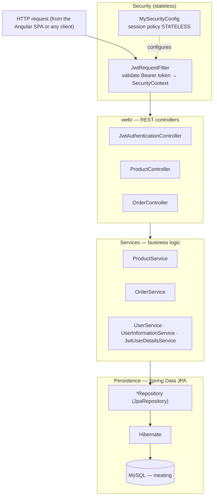
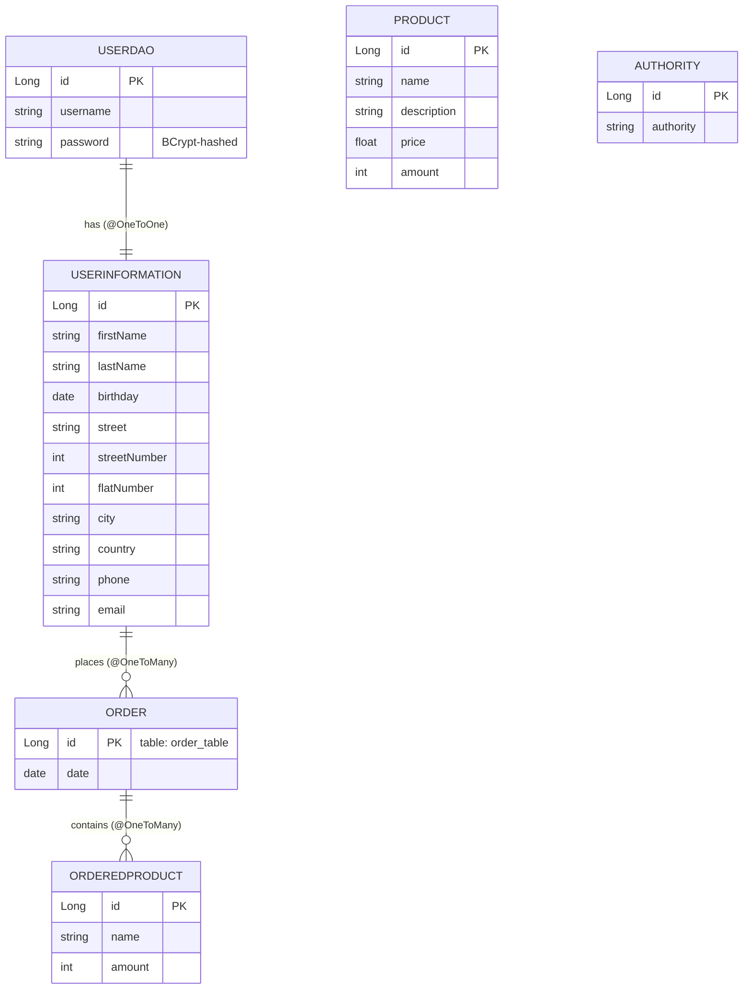

# 🥩 Meating — Store Backend (Spring Boot REST API)

> The **Spring Boot (Java 17)** REST backend for the *Meating* beef-jerky shop: a stateless,
> JWT-secured API that serves the product catalogue, validates stock, and places orders for both
> registered and guest users, persisting everything to **MySQL** via Spring Data JPA. It is consumed
> by the companion Angular single-page frontend.

<p>
  
  
  
  
  
  
  
  
</p>

> ℹ️ This is **one half of a two-app system**. The browser UI lives in the separate **Meating Store
> Frontend** (Angular 13 SPA), which calls this API. This service is fully usable on its own via any
> HTTP client (cURL / Postman).

---

## Table of Contents

1. [Purpose](#-purpose)
2. [Main Features](#-main-features)
3. [Tech Stack](#-tech-stack)
4. [Architecture](#-architecture)
5. [Domain Model](#-domain-model)
6. [Authentication Flow](#-authentication-flow)
7. [API Reference](#-api-reference)
8. [Quickstart](#-quickstart)
9. [Configuration](#-configuration)
10. [Project Layout](#-project-layout)
11. [Known Limitations](#-known-limitations)

---

## 🎯 Purpose

**Meating Back** (`pl.meating.meatingback`) is the server side of a small but complete online store.
It exposes a REST API that lets clients browse products, register and authenticate, check stock
availability, and place orders. The order flow validates requested quantities against the database and
decrements inventory on purchase; **guests** (unregistered users) can also order by supplying delivery
details inline.

It is a portfolio/learning project that demonstrates a classic **layered Spring Boot service** with
**stateless JWT security**, a **DTO ↔ entity** mapping layer, and a custom bean-validation annotation.

---

## ✨ Main Features

- ✅ **Stateless JWT authentication** (`/authenticate`) + registration (`/register`)
- ✅ **BCrypt** password hashing
- ✅ **Product catalogue** — list / add / delete
- ✅ **Stock-availability check** before ordering (`/order/check`)
- ✅ **Order placement** for both **registered** (Bearer-authenticated) and **guest** users
- ✅ **Transactional inventory decrement** on purchase
- ✅ **DTO ↔ entity mapping** layer (`*Mapper`, `*Dto`)
- ✅ **Custom bean-validation annotation** (`@TotalNumber` + `TotalNumberValidator`)
- ✅ **Seed data** bootstrapped from `data.sql` on startup

---

## 🧰 Tech Stack

| Layer | Technology |
|---|---|
| Language | **Java 17** |
| Framework | **Spring Boot 2.6.7** — Web MVC, Data JPA, Security, Validation, DevTools, Thymeleaf* |
| Security | **Spring Security** (stateless) + **JWT** via `io.jsonwebtoken` (jjwt-api/impl/gson **0.11.5**), `BCryptPasswordEncoder` |
| Persistence | **Spring Data JPA** over **Hibernate**, **MySQL 8** (`mysql-connector-java`), `ddl-auto=update`, `data.sql` bootstrap |
| Boilerplate | **Project Lombok** (`@Data`, `@RequiredArgsConstructor`, …) |
| Build | **Maven** (with `mvnw` wrapper) |

> \* Thymeleaf + `thymeleaf-extras-springsecurity5` are declared but effectively unused — the UI is
> the separate Angular SPA, so no server-side templates are rendered. The `spring-boot-starter-validation`
> dependency is (oddly) declared at **test** scope.

---

## 🏛 Architecture

Classic **Controller → Service → Repository** layering, organised **by feature** (`product`, `order`,
`user`, `user.userdetails`), fronted by a stateless JWT security filter chain.



**Package responsibilities**

| Package | Responsibility |
|---|---|
| `web/` | REST controllers (`JwtAuthenticationController`, `ProductController`, `OrderController`) |
| `product/` | `Product` entity, `ProductDto`, `ProductMapper`, `ProductRepository`, `ProductService` |
| `order/` | `Order` (`order_table`), `OrderedProduct`, `UnregisteredUserOrder`, DTO/mapper/repositories/service |
| `user/` | `UserDao`, `Authority`, `UserRepository`, `UserService` + `dto/` (auth/login/register beans) |
| `user/userdetails/` | `UserInformation` (personal + delivery details), repository, service |
| `jwt/` | `JwtTokenUtil`, `JwtRequestFilter`, `JwtUserDetailsService`, `JwtAuthenticationEntryPoint` |
| `config/` | `MySecurityConfig` (Spring Security, stateless session, filter chain) |
| `validators/` | `@TotalNumber` annotation + `TotalNumberValidator` |

---

## 🗃 Domain Model



- **`UserDao` 1—1 `UserInformation`** (cascade ALL); `UserInformation` owns a list of `Order`s.
- **`Order` 1—* `OrderedProduct`** — a line item stores only `name` + `amount` (a loose snapshot; it is
  **not** a foreign key to `Product`, and it does not capture price).
- **`Product`** is queried directly for the catalogue and stock checks — it stands alone from the order graph.
- **`Authority`** exists as an entity, but its link from `UserDao` is **commented out** in the code, so
  role data is not currently wired in (see [Known Limitations](#-known-limitations)).

---

## 🔐 Authentication Flow

```mermaid
sequenceDiagram
    autonumber
    participant FE as Client (Angular SPA)
    participant AC as JwtAuthenticationController
    participant AM as AuthenticationManager
    participant UDS as JwtUserDetailsService
    participant JU as JwtTokenUtil
    FE->>AC: POST /authenticate { username, password }
    AC->>AM: authenticate(username, password)
    AM->>UDS: loadUserByUsername(username)
    UDS-->>AM: UserDetails (BCrypt password check)
    AC->>JU: generateToken(userDetails)
    JU-->>AC: signed JWT
    AC-->>FE: JwtResponse { token }
    Note over FE,AC: later calls send Authorization: Bearer &lt;jwt&gt;;<br/>JwtRequestFilter validates it and populates the SecurityContext
```

---

## 📡 API Reference

Base URL: `http://localhost:8081`.

| Method | Endpoint | Auth | Description |
|--------|----------|------|-------------|
| POST | `/authenticate` | none | Log in, returns a signed JWT |
| POST | `/register` | none | Register a new user (creates `UserDao` + `UserInformation`) |
| GET  | `/product/getallproducts` | none | List products |
| POST | `/product/add` | none* | Add a product |
| DELETE | `/product/delete?name=` | none* | Delete a product by name |
| POST | `/order/check` | none | Validate cart stock against inventory |
| POST | `/order/addorder` | Bearer | Place order (registered user, resolved from JWT) |
| POST | `/order/addorderwithinfo` | none | Place order (guest — delivery info + cart) |
| POST | `/order/adddetails` | none | Save a user's delivery details |
| GET  | `/order` | none* | List all orders |

`*` ⚠️ The security config permits **all** requests (`antMatchers("/**").permitAll()`), so endpoints
that *should* be admin-only are in practice unauthenticated. Lock these down before any real use.

---

## 🚀 Quickstart

### Prerequisites
- JDK 17, Maven (or the bundled `mvnw`)
- MySQL 8 running locally

### Run
```bash
# 1. Create the database (default credentials in application.properties: root / admin)
mysql -u root -p -e "CREATE DATABASE meating;"

# 2. (Recommended) override the committed secrets — see WARNING below
#    edit src/main/resources/application.properties

# 3. Run
./mvnw spring-boot:run        # Windows: mvnw.cmd spring-boot:run
```
The API comes up at **http://localhost:8081**. On startup Hibernate updates the schema
(`ddl-auto=update`) and `data.sql` seeds initial rows (`spring.sql.init.mode=always`).

### Smoke test
```bash
curl http://localhost:8081/product/getallproducts
curl -X POST http://localhost:8081/authenticate \
  -H "Content-Type: application/json" \
  -d '{"username":"user","password":"pass"}'
```

### Tests
```bash
./mvnw test    # only a Spring context-load smoke test exists
```

> ⚠️ **Security warning:** the repository ships with a **hardcoded DB password (`admin`)** and a
> **hardcoded JWT secret** in `application.properties`. Change both before any non-local use, and
> prefer environment variables / a secrets manager.

---

## ⚙️ Configuration

`src/main/resources/application.properties`:

```properties
spring.datasource.url=jdbc:mysql://localhost:3306/meating
spring.datasource.username=root
spring.datasource.password=admin
spring.sql.init.mode=always            # run data.sql on every startup
spring.jpa.hibernate.ddl-auto=update   # Hibernate maintains the schema
server.port=8081
jwt.secret=<hardcoded HMAC secret>     # ⚠️ move to an env var / secret store
```

---

## 📁 Project Layout

```
internet-store-backend-main/
├── pom.xml                         # Maven build (Spring Boot 2.6.7, Java 17)
├── mvnw / mvnw.cmd                 # Maven wrapper
└── src/
    ├── main/
    │   ├── java/pl/meating/meatingback/
    │   │   ├── MeatingBackApplication.java
    │   │   ├── web/            # ProductController, OrderController, JwtAuthenticationController
    │   │   ├── product/        # Product, ProductDto, ProductMapper, ProductRepository, ProductService
    │   │   ├── order/          # Order, OrderedProduct, UnregisteredUserOrder, dto/mapper/repos/service
    │   │   ├── user/           # UserDao, Authority, UserRepository, UserService, dto/
    │   │   │   └── userdetails/# UserInformation (+ dto, repository, service)
    │   │   ├── jwt/            # JwtTokenUtil, JwtRequestFilter, JwtUserDetailsService, JwtAuthenticationEntryPoint
    │   │   ├── config/         # MySecurityConfig
    │   │   └── validators/     # @TotalNumber + TotalNumberValidator
    │   └── resources/
    │       ├── application.properties
    │       └── data.sql        # seed data
    └── test/java/.../MeatingBackApplicationTests.java   # context-load only
```

---

## ⚠️ Known Limitations

- **No effective authorization** — `MySecurityConfig` permits all requests, so "admin" endpoints
  (`/product/add`, `/product/delete`, `/order`) are unauthenticated in practice.
- **Hardcoded secrets** — DB password and the JWT signing secret are committed in
  `application.properties`.
- **Dead authorization model** — the `Authority` entity is defined, but the `UserDao → Authority`
  relationship is commented out, so roles are never persisted or enforced.
- **Lossy order lines** — `OrderedProduct` stores only `name` + `amount` (no price/description snapshot).
- **Minimal tests** — only a Spring context-load smoke test.
- **Unused stack** — Thymeleaf starters are pulled in but never used (the UI is the Angular SPA).
